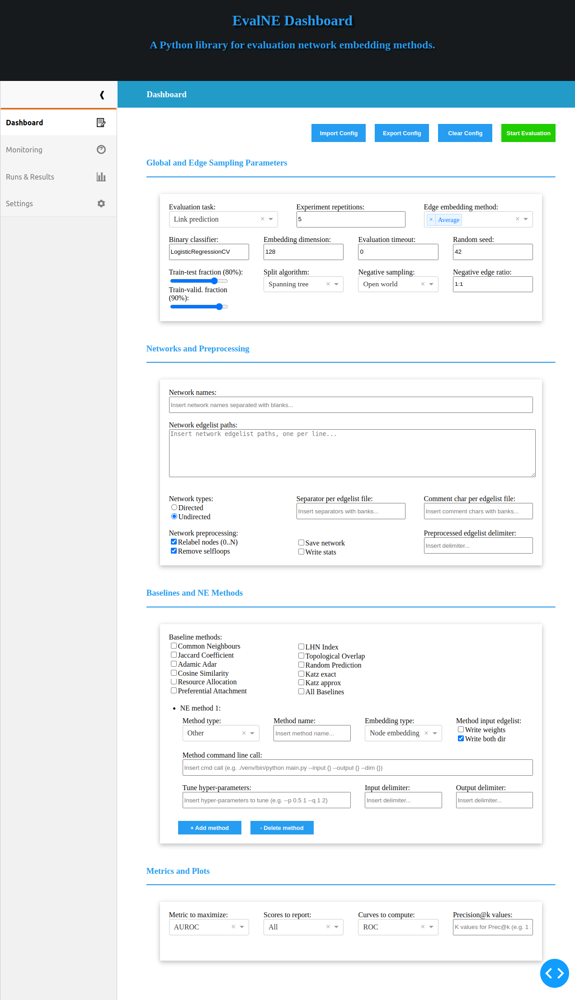

# EvalNE-GUI: The Graphical User Interface for <a href="https://github.com/Dru-Mara/EvalNE">EvalNE</a> #

<div id="top"></div>

[](https://github.com/aida-ugent/evalne-ui-dev/issues)
[](https://github.com/aida-ugent/evalne-ui-dev/blob/master/LICENSE)
[](https://www.python.org/)

<!-- TABLE OF CONTENTS -->
<details>
  <summary>Table of Contents</summary>
  <ol>
    <li><a href="#about">About EvalNE-GUI</a></li>
    <li><a href="#installation">Installation</a></li>
    <li>
      <a href="#usage">Usage</a>
        <ul>
          <li><a href="#dashboard-tab">Dashboard tab</a></li>
          <li><a href="#monitoring-tab">Monitoring tab</a></li>
          <li><a href="#runs-&-results-tab">Runs & Results tab</a></li>
          <li><a href="#settings-tab">Settings tab</a></li>
        </ul>
    </li>
    <li><a href="#contributing">Contributing</a></li>
    <li><a href="#license">License</a></li>
    <li><a href="#citation">Citation</a></li>
  </ol>
</details>

## About ##

This repository contains the source code of the EvalNE-GUI, an open-source graphical user interface for EvalNE 
based on Plotly's Dash framework. The interface allows users to set up and execute EvalNE evaluations in an 
intuitive and interactive way, monitor system resources and browse previous evaluations. More information about 
EvalNE can be found in the official [GitHub repo](https://github.com/Dru-Mara/EvalNE), and the 
[user documentation](https://evalne.readthedocs.io/en/latest/). This library and the official EvalNE implementations are 
maintained by Alexandru Mara (alexandru.mara(at)ugent.be).

In summary, the main functionalities of the EvalNE-GUI include:

* A dashboard that allows users to specify evaluation parameters
* Tools for importing and exporting EvalNE configuration files
* Functionalities for running evaluations directly from the EvalNE-GUI
* Live monitoring of the system resources used by EvalNE and the EvalNE-GUI
* Functionalities for exploring past evaluation setups, logs and results 

<p align="right">(<a href="#top">back to top</a>)</p>


## Installation ## 

The user interface has been tested on Python 3.8 and requires the following packages:

* numpy
* plotly
* dash
* dash-daq
* dash_bootstrap_components
* fa2
* psutil
* evalne (optional)

**NOTE:** The evalne package is not a strict dependency of the GUI. This package can be installed in any 
other virtual environment but the appropriate path to it must then be specified in the EvalNE-GUI Settings tab. 
If evalne is not detected when an evaluation is started from the GUI, an error message will be displayed. 

The EvalNE-GUI can be installed from pip or by cloning the GitHub repository: 

**Option 1:** Install the library using pip:
```bash
# Ensure that setuptools is up to date using:
pip3 install --upgrade setuptools

# Install the library using pip:
pip3 install evalne_gui
```

**Option 2:** Cloning the repository and installing:
```bash
# Clone the github repository
git clone https://github.com/aida-ugent/evalne-gui
cd EvalNE-gui

# Ensure that setuptools is up to date using:
pip3 install --upgrade setuptools

# Install the library using setup.py
python3 setup.py install
```

To launch the GUI simply execute the `evalne-gui` script. Alternatively, the `__main__.py` file can be executed 
using Python. A new browser tab will open showing the user interface.
```bash
evalne_gui
# Alternatively: python3 evalne_gui/__main__.py 
```

**NOTE:** If the GUI was installed in a virtualenv the launch script should be executed as 
`venv/bin/evalne_gui`.

<p align="right">(<a href="#top">back to top</a>)</p>


## Usage ##

The EvalNE-GUI features 4 tabs which provide access to the evaluation **Dashboard**, system resource **Monitoring**, 
previous **Runs & Results** and general app **Settings**. 

<div align="center">

</div>

### Dashboard tab ###
This tab allows users to specify all the evaluation parameters, from the data and methods to use to the downstream
task, results to report, etc. This can be done either manually or by importing an existing EvalNE config file. 
Once all required parameters are set, an evaluation can be launched using the `Run Evaluation` button. Evaluations 
can be stopped at any time by pressing the `Stop Evaluation` button. Config files can be imported and exported 
using the appropriate buttons and the default parameter values can be restored using `Clear Config`. 

**NOTE:** The EvalNE-GUI persists all values inputted in any field. Tabs can be switched and the app can even be 
closed without these values being lost.

### Monitoring tab ###
The Monitoring tab contains plots displaying the main system resources used such as CPU and RAM. 
In addition to this, the tab also provides specific information regarding the EvalNE (when running) and EvalNE-GUI 
processes such as status, resources used, current working directory, etc. Finally, the output of the current or 
last evaluation launched (if any), is also displayed. 

### Runs & Results tab ###
The Runs and Results tab summarizes current and previous evaluation runs. For each run the filename, status 
(running, failed, finished), runtime, and the start and end times are displayed. By clicking on any run the 
evaluation logs and results can also be visualized.

### Settings tab ###
This tab allows users to specify global EvalNE parameters such as the path there the library is installed
(if different from the EvalNE-GUI installation path) or the folder where to store new evaluation runs.

<p align="right">(<a href="#top">back to top</a>)</p>


## Contributing

Contributions are **greatly appreciated**. If you want to help us improve the EvalNE-GUI, 
please fork the repo and create a new pull request. Don't forget to give the project a star! Thanks!

1. Fork the Project
2. Create your Feature Branch (`git checkout -b feature/AmazingFeature`)
3. Commit your Changes (`git commit -m 'Add some AmazingFeature'`)
4. Push to the Branch (`git push origin feature/AmazingFeature`)
5. Open a Pull Request

Alternatively, you can make suggestions or report bugs by opening a new issue with the appropriate tag 
("feature" or "bug") and following our Contributing template.

<p align="right">(<a href="#top">back to top</a>)</p>


## License

Distributed under the MIT License. See `LICENSE.txt` for more information.

<p align="right">(<a href="#top">back to top</a>)</p>


## Citation ##

If you have found EvaNE or the EvalNE-GUI useful in your research, please consider giving our repos a star 
and citing our [paper](https://www.sciencedirect.com/science/article/pii/S2352711022000139):

```bibtex
    @article{MARA2022evalne,
      title = {EvalNE: A Framework for Network Embedding Evaluation},
      author = {Alexandru Mara and Jefrey Lijffijt and Tijl De Bie},
      journal = {SoftwareX},
      volume = {17},
      pages = {},
      year = {2022},
      issn = {100997},
      doi = {10.1016/j.softx.2022.100997},
      url = {https://www.sciencedirect.com/science/article/pii/S2352711022000139}
    }
```

<p align="right">(<a href="#top">back to top</a>)</p>

