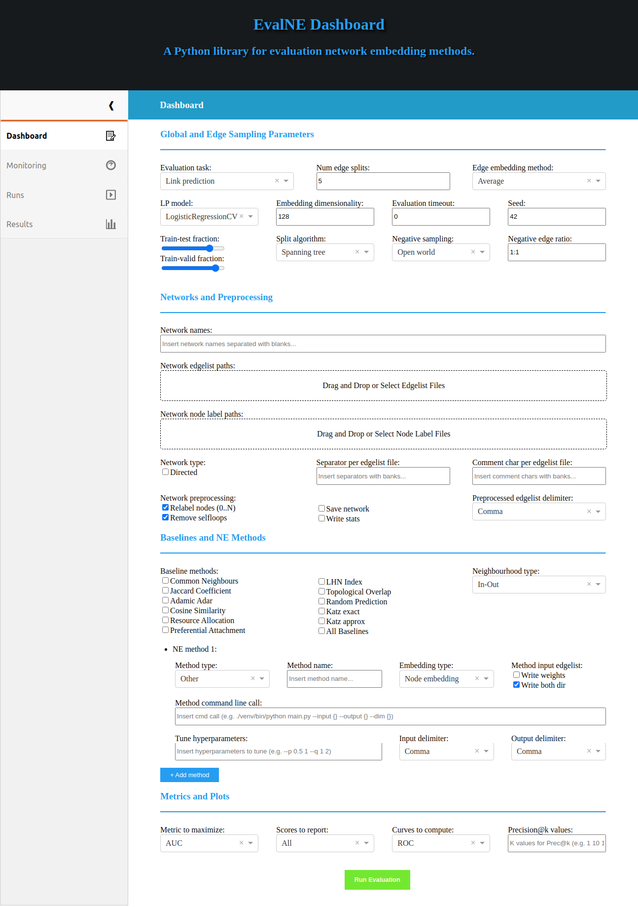

# EvalNE-UI: A User Interface for <a href="https://github.com/Dru-Mara/EvalNE">EvalNE</a> #

<div id="top"></div>

[](https://github.com/aida-ugent/evalne-ui-dev/issues)
[](https://github.com/aida-ugent/evalne-ui-dev/blob/master/LICENSE)
[](https://www.python.org/)
[](https://www.sphinx-doc.org/)

<!-- TABLE OF CONTENTS -->
<details>
  <summary>Table of Contents</summary>
  <ol>
    <li>
      <a href="#about-evalne">About EvalNE</a>
      <ul>
        <li><a href="#for-methodologists">For methodologists</a></li>
        <li><a href="#for-practitioners">For practitioners</a></li>
      </ul>
    </li>
    <li><a href="#installation">Installation</a></li>
    <li>
      <a href="#usage">Usage</a>
        <ul>
          <li><a href="#as-a-command-line-tool">As a command line tool</a></li>
          <li><a href="#as-an-api">As an API</a></li>
          <li><a href="#output">Output</a></li>
        </ul>
    </li>
    <li><a href="#contributing">Contributing</a></li>
    <li><a href="#license">License</a></li>
    <li><a href="#citation">Citation</a></li>
  </ol>
</details>

## TODO ##

* DONE Make tab data persistent, for when tabs are switched
* Make run evaluation actually fill in conf file and execute evalne
* Make import/export buttons work
* DONE Fix button hoover
* DONE Toggle Run Evaluation/Stop Evaluation on btn click
* DONE Use interval object to keep Start/Stop button appearance consistent with eval state
* DONE Change data drag & drop to textfield
* Add monitoring plots
* Fill in Runs tab
* Collect in Results the evaluation outputs of previous runs
* Ask for a folder path to track (where results are being stored) default to the evalne folder?


## About ##

This repository provides the source code for the EvalNE-UI, an open-source user interface for EvalNE based on
Plotly Dash. The interface allows users to interact with the evaluation toolbox in an intuitive and visual way.
More information about EvalNE can be found in the official repo, [here](https://github.com/Dru-Mara/EvalNE), and 
the user documentation, [here](https://evalne.readthedocs.io/en/latest/). This library and the official EvalNE 
implementations are maintained by Alexandru Mara (alexandru.mara(at)ugent.be).

The main functionalities of the library include:

* A dashboard that allows users to specify all evaluation parameters
* Functionalities for running evaluations
* Tools to import and export EvalNE config files
* A system monitoring interface to keep track of the resources used by the toolbox
* Functionalities to explore evaluation logs and past runs 

<p align="right">(<a href="#top">back to top</a>)</p>


## Instalation ## 

The user interface has been tested on Python 3.8 and depens on the following packages:

* evalne
* numpy
* scipy
* pandas
* networkX
* scikit-learn
* dash
* dash-daq
* f2a

Before installing the EvalNE-UI make sure that `pip` and `python-tk` packages are installed 
on your system, this can be done by running:
```bash
sudo apt-get install python3-pip
sudo apt-get install python3-tk
```

**Option 1:** Install the library using pip:
```bash
pip3 install evalne-ui
```

**Option 2:** Cloning the code and installing:

- Clone the EvalNE-UI repository:
    ```bash
    git clone https://github.com/aida-ugent/evalne-ui-dev
    cd EvalNE-ui
    ```

- Download library dependencies and install:
    ```bash
    pip3 install -r requirements.txt
    sudo python3 setup.py install
    ```

To launch the UI simply execute the index.py Python file. This will open a new browser tab showing the UI.
```bash
python3 index.py
```

<p align="right">(<a href="#top">back to top</a>)</p>


## Usage ##

The UI features 4 tabs which provide access to the Dashboard, system Monitoring, evaluation Runs 
and experimental Results. 

<div align="center">

</div>

In the Dashboard tab the user can specify evaluation parameters. This can be done by manually 
setting each parameter or by importing existing conf files. Once the required parameters are set,
the evaluation can be launched using the `Run Evaluation` button. 

The Monitoring tab contains plots displaying the main system resources such as CPU, GPU, RAM and DISK use. 
In addition to this, the tab also provides specific information regarding the EvalNE evaluation processes 
being executed such as stage of the execution and resources consumed.

The Runs and Results tabs summarize previous evaluation runs providing access to the evaluation logs and 
results.

<p align="right">(<a href="#top">back to top</a>)</p>


## Contributing

Contributions are **greatly appreciated**. If you want to help us improve the EvalNE-UI, 
please fork the repo and create a new pull request. Don't forget to give the project a star! Thanks!

1. Fork the Project
2. Create your Feature Branch (`git checkout -b feature/AmazingFeature`)
3. Commit your Changes (`git commit -m 'Add some AmazingFeature'`)
4. Push to the Branch (`git push origin feature/AmazingFeature`)
5. Open a Pull Request

Alternatively, you can make suggestions or report bugs by opening a new issue with the appropriate tag 
("feature" or "bug") and following our Contributing template.

<p align="right">(<a href="#top">back to top</a>)</p>


## License

Distributed under the MIT License. See `LICENSE.txt` for more information.

<p align="right">(<a href="#top">back to top</a>)</p>


## Citation ##

If you have found EvaNE or the EvalNE-UI useful in your research, please consider giving the repo a star 
and citing our [arXiv paper](https://arxiv.org/abs/1901.09691):

```bibtex
    @article{MARA2022evalne,
      title = {EvalNE: A Framework for Network Embedding Evaluation},
      author = {Alexandru Mara and Jefrey Lijffijt and Tijl {De Bie}},
      journal = {SoftwareX},
      volume = {17},
      pages = {},
      year = {2022},
      issn = {100997},
      doi = {10.1016/j.softx.2022.100997},
      url = {https://www.sciencedirect.com/science/article/pii/S2352711022000139}
    }
```

<p align="right">(<a href="#top">back to top</a>)</p>

